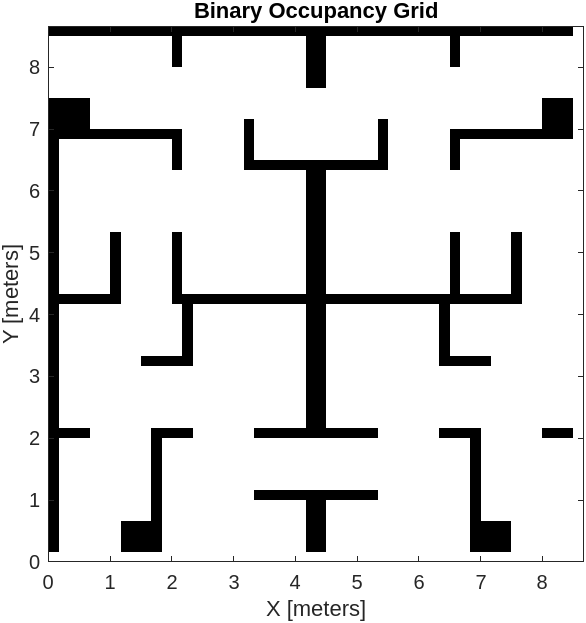
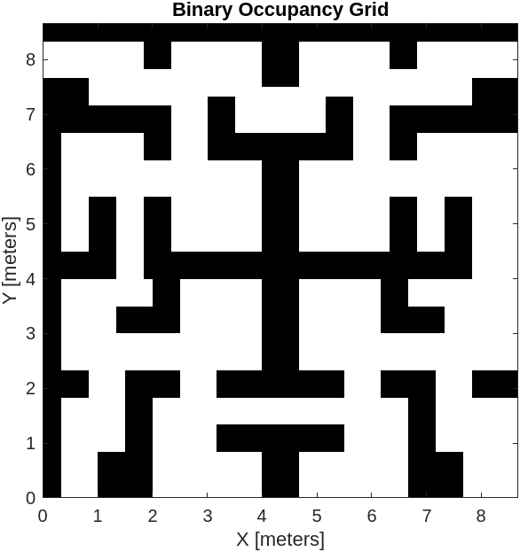
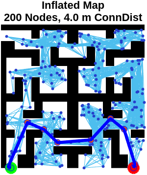
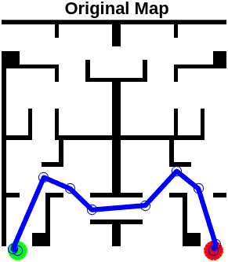

# Navegación por planeación mapas
# Integrantes
* Andrés Serna
* Joan Pinilla

# Modelo del robot
Crear el modelo cinemático del robot en MATLAB.

```matlab
function motor_speeds = computeWheelSpeeds(v, omega)
    % Robot parameters
    R = 0.0975;   % Wheel radius [m]
    L = 0.331;    % Distance between wheels [m]
    
    % Compute individual wheel angular velocities (rad/s)
    omega_L = (v - (L/2)*omega) / R;
    omega_R = (v + (L/2)*omega) / R;
    
    % Return as a 1x2 array: [left, right]
    motor_speeds = [omega_L, omega_R];
end
```

Con esta función se puede tomar la velocidad lineal y le velocidad angular del robot y presentarlas como velocidades en las ruedas para que este pueda seguri la trayectoria.

# Mapas
2.1. Crear el mapa con la resolución indicada, informar el nombre del mapa y presentarlo en
una figura 1.

<div style="text-align: center;">
  
  <p style="font-style: italic; margin-top: 8px;">Figura 1. Mapa original</p>
</div>

2.2. De acuerdo con el robot asignado, calcule e informe el valor de inflado adecuado, haga el
inflado de los obstáculos y presente el mapa inflado en una figura 2. Informe el nombre
del mapa inflado.

Tomando la trocha del robot P3DX de L = 0.331 m, se infla el mapa:

<div style="text-align: center;">
  
  <p style="font-style: italic; margin-top: 8px;">Figura 2. Mapa inflado</p>
</div>

# Planeación PRM
3.1. Ejecute el método de planeación PRM.
3.2. Informe los valores de los parámetros usados MaxNumNodes y MaxConnectionDistance
para obtener la ruta.

Para encontrar la mejor ruta se hizo un sweep de parámetros de número de nodos desde los 100 hasta los 300 en intervalos de 50, mientras que para la distancia de conexión fue desde los 1.5 hasta los 4.5 m con intervalos de 0.5m.

3.3. Encuentre la ruta óptima entre el punto de inicio y el punto objetivo y presentarla en una
tabla.

Cada combinación de parámetros se intentó 3 veces. Los resultados del sweep se muestran a continuación:

| Nodes | ConnDist | PathLength |     Status     |    Time    |
|------:|---------:|-----------:|:--------------:|-----------:|
|   100 |      1.5 |        NaN | "NoPathFound"  |  0.067318  |
|   100 |        2 |     14.94  | "Success"      |  0.038143  |
|   100 |      2.5 |    15.248  | "Success"      |  0.0534    |
|   100 |        3 |    12.961  | "Success"      |  0.053921  |
|   100 |      3.5 |    23.042  | "Success"      |  0.10871   |
|   100 |        4 |        NaN | "NoPathFound"  |  0.097709  |
|   100 |      4.5 |    16.464  | "Success"      |  0.10968   |
|   150 |      1.5 |        NaN | "NoPathFound"  |  0.068378  |
|   150 |        2 |    13.286  | "Success"      |  0.10819   |
|   150 |      2.5 |    13.004  | "Success"      |  0.11799   |
|   150 |        3 |    12.478  | "Success"      |  0.19015   |
|   150 |      3.5 |    14.191  | "Success"      |  0.29624   |
|   150 |        4 |    14.423  | "Success"      |  0.15771   |
|   150 |      4.5 |     18.58  | "Success"      |  0.14174   |
|   200 |      1.5 |    13.864  | "Success"      |  0.063701  |
|   200 |        2 |    14.237  | "Success"      |  0.11232   |
|   200 |      2.5 |    12.941  | "Success"      |  0.13174   |
|   200 |        3 |    12.136  | "Success"      |  0.14901   |
|   200 |      3.5 |    12.551  | "Success"      |  0.21338   |
|   200 |        4 |    11.836  | "Success"      |  0.23026   |
|   200 |      4.5 |    12.317  | "Success"      |  0.27281   |
|   250 |      1.5 |    12.891  | "Success"      |  0.099884  |
|   250 |        2 |     13.71  | "Success"      |  0.14553   |
|   250 |      2.5 |    12.924  | "Success"      |  0.18504   |
|   250 |        3 |     12.71  | "Success"      |  0.27153   |
|   250 |      3.5 |    12.663  | "Success"      |  0.30223   |
|   250 |        4 |    12.343  | "Success"      |  0.36431   |
|   250 |      4.5 |    12.813  | "Success"      |  0.41066   |
|   300 |      1.5 |    12.435  | "Success"      |  0.13059   |
|   300 |        2 |     12.48  | "Success"      |  0.18554   |
|   300 |      2.5 |    12.475  | "Success"      |  0.24347   |
|   300 |        3 |     13.12  | "Success"      |  0.33024   |
|   300 |      3.5 |    13.279  | "Success"      |  0.38374   |
|   300 |        4 |    12.536  | "Success"      |  0.51095   |
|   300 |      4.5 |    13.037  | "Success"      |  0.52807   |

3.4. Presentar en una figura 3 el mapa sin inflar, el grafo solución del algoritmo y la ruta óptima.

<div style="text-align: center;">
  
  <p style="font-style: italic; margin-top: 8px;">Figura 3a. Mapa inflado con solución</p>
</div>

<div style="text-align: center;">
  
  <p style="font-style: italic; margin-top: 8px;">Figura 3b. Mapa original con solución</p>
</div>

3.5. Informe cuál es la función de costo usada y su valor para la ruta óptima.

La ruta óptima se logró con los siguientes parámetros:

Nodos: 200 y Distanica de conexión =4.0 m

La función de costo usada en este caso es la de distancia euclidiana, para este caso, tuvo un valor de 11.84 m. 

# Planeación RRT
Hacer las mismas actividades realizadas para el algoritmo PRM. En este caso informar los
valores de los parámetros MinIterations y ConnectionDistance.


# Simulación en CoppeliaSim

5.4. Adicione uno o más Force Sensor y úselos como medio de fijación de las paredes al piso.
Figura 1
5.5. Adicione el robot asignado en la pose inicial usada en su planeación de rutas.
5.6. Adicione los archivos y scripts necesarios para que se pueda conectar la escena de Coppe-
liaSim con MATLAB.
5.7. Presente una imagen de la escena donde sean visibles las dimensiones de las paredes y el
robot.


# Simulación MATLAB Y COPPELIASIM
Para establecer la conexión entre MATLAB y CoppeliaSim de forma robusta y funcional, se utilizó la Remote API de CoppeliaSim, que permite a MATLAB actuar como cliente y enviar comandos directamente al simulador. Este procedimiento inició con la instrucción `simxFinish(-1)`, que garantiza la terminación de cualquier conexión previa con el servidor de CoppeliaSim, previniendo errores de conflicto o comunicación duplicada que podrían surgir si una sesión anterior no se cerró correctamente. Seguidamente, se ejecutó `simxStart` con los parámetros correspondientes para establecer una nueva conexión TCP/IP con el servidor en la dirección localhost (`'127.0.0.1'`) y el puerto `19000`, habilitado previamente desde el script de CoppeliaSim mediante un puerto de servidor explícito.

El protocolo utilizado fue sincrónico, empleando el flag `true` en la opción de reconexión (`waitUntilConnected`), lo que asegura que el proceso de conexión no continúe hasta que esta se haya establecido satisfactoriamente. Una vez que la conexión fue exitosa (es decir, `clientID` > -1), se procedió a la transmisión de datos necesarios para ejecutar el movimiento del robot sobre el entorno simulado.

La trayectoria previamente calculada en MATLAB se descompuso en una secuencia de puntos cartesianos, los cuales se enviaron uno a uno a CoppeliaSim como señales de cadena utilizando la función `simxWriteStringStream`. Cada punto fue transformado a un formato serializado (por ejemplo, `simxPackFloats`) que convierte el vector de coordenadas en un arreglo de bytes compatible con el sistema de señales de CoppeliaSim. Estas señales se nombraron de forma consistente, por ejemplo `waypointData`, para que el script de control en CoppeliaSim pudiera identificar y leer el flujo de datos correspondiente mediante el uso de funciones como `sim.readStringStream` y `sim.unpackFloatTable`.

Entre cada envío de punto se introdujo una pausa breve (`pause(0.1)`), que garantiza que CoppeliaSim reciba y procese la señal antes de que se transmita el siguiente punto. Este mecanismo actúa como una forma básica de sincronización, especialmente útil cuando la ejecución en CoppeliaSim depende de secuencias ordenadas de eventos o cuando se espera una respuesta del simulador antes de continuar. Alternativamente, se podrían implementar protocolos de handshaking más complejos si se requiere retroalimentación del simulador.

En el entorno de CoppeliaSim, un script asociado al robot (escrito en Lua) se encargó de interpretar las señales recibidas y ejecutar los movimientos físicos correspondientes. Esto se realizó mediante funciones de movimiento como `sim.setObjectPosition` o comandos de navegación más avanzados que procesaban los waypoints como nodos de una trayectoria. El robot siguió estos puntos de forma secuencial, permitiendo verificar en tiempo real la eficacia del planificador de rutas y del mecanismo de control.

Una vez completada la transmisión de todos los puntos y concluida la simulación del movimiento, se finalizó la sesión cerrando la conexión mediante `simxFinish(clientID)`, liberando los recursos asociados y asegurando una desconexión limpia.
# Conclusiones

El trabajo realizado integrando MATLAB y CoppeliaSim permitió desarrollar y validar de forma eficiente un sistema completo de planificación y navegación para robots móviles sobre mapas previamente conocidos. A través del uso del algoritmo PRM (Probabilistic Roadmap), se exploraron diversas configuraciones de parámetros como el número de nodos y la distancia de conexión para encontrar rutas óptimas entre un punto de inicio y un objetivo en un entorno con obstáculos. Este proceso se realizó sobre un mapa binario ajustado y preprocesado para incluir márgenes de seguridad mediante inflación, garantizando que el robot pudiera navegar sin colisiones.

La conexión entre MATLAB y CoppeliaSim, establecida mediante la Remote API, fue un componente crucial del proyecto. Esta conexión permitió que los resultados generados por los algoritmos de planificación de rutas en MATLAB fueran enviados directamente al entorno de simulación física de CoppeliaSim, donde el comportamiento del robot se pudo observar de forma visual y detallada. Gracias a este puente de comunicación, se logró una validación práctica de los algoritmos desarrollados, permitiendo contrastar los resultados teóricos con el comportamiento realista del robot en un entorno simulado. El envío secuencial de puntos de trayectoria, transformados en señales compatibles con CoppeliaSim, garantizó una navegación precisa y controlada del robot.

Este enfoque no solo proporciona una herramienta poderosa para evaluar el desempeño de los algoritmos de navegación, sino que también sirve como una base sólida para aplicaciones futuras, como control en tiempo real, seguimiento de trayectorias con feedback, y validación de sistemas de percepción y control sobre plataformas móviles. La integración entre ambas plataformas refuerza la importancia del trabajo conjunto entre planificación algorítmica y simulación física, lo que permite iterar y mejorar los diseños de manera segura, flexible y con altos niveles de fidelidad antes de implementar en entornos reales.
