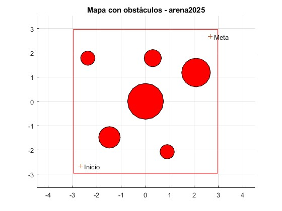
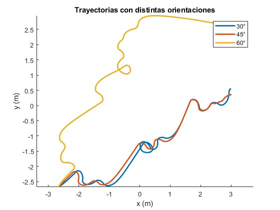
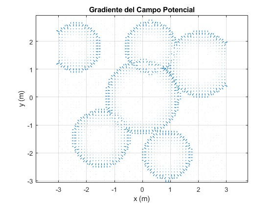
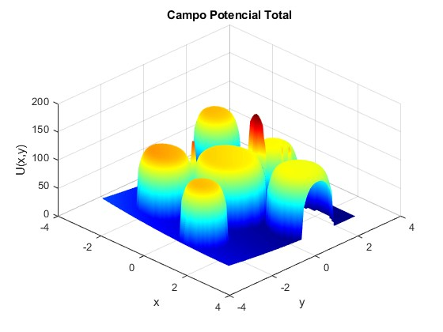

# Navegación por Campo potencial
## Integrantes
* Andrés Serna
* Joan Pinilla

[Repositorio](https://github.com/JoanPinilla/FRM-2025-1/tree/main/Tarea%20Navegaci%C3%B3n%20por%20Campo%20Potencial)

## Modelo del robot
Crear el modelo cinemático del robot en MATLAB. El robot Pioneer P3DX es un robot de tipo diferencial cuya cinemática se describe mediante el siguiente sistema de ecuaciones:

dx/dt = v * cos(θ)  
dy/dt = v * sin(θ)  
dθ/dt = ω

Donde:
𝑣 es la velocidad lineal, 𝜔 es la velocidad angular y θ es el ángulo de orientación del robot respecto al eje 𝑥.

El modelo fue implementado en MATLAB en una función llamada `modeloP3DX.m`, utilizada para simular el movimiento del robot.

## Mapas
### 2.1. Cálculo del radio R del círculo que incluye al robot. 
Las dimensiones aproximadas del robot Pioneer P3DX son:

- Ancho: 0.381 m  
- Largo: 0.455 m  
- Radio de inclusión:  
  R = sqrt((0.381)^2 + (0.455)^2) / 2 ≈ 0.296 m
- Factor de escala para el entorno:  
  k = 10 * R = 2.96

### 2.2. Mapa con obstáculos

Se generó un mapa con 6 obstáculos circulares mediante el script `arena2025.m`, modificando el parámetro de escala `k`.



### 2.3 Campo repulsivo sigmoidal

En lugar del campo parabólico, se implementó un campo repulsivo suave usando la función sigmoidal:

f(d) = 1 / (1 + exp(-a * (d - d₀)))

U_rep = k_rep * (1 - f(d))

Esto permite un campo de fuerza continua y sin discontinuidades alrededor de los obstáculos. Al mapa generado le asignamos el nombre: 

**`Mapa_Pioneer296`**

---

## 3. Navegación por Campo Potencial

### 3.1 Trayectorias con distintas orientaciones

Se simularon tres trayectorias con orientaciones iniciales distintas:

- 30°
- 45°
- 60°

El robot parte del extremo inferior izquierdo del entorno y se dirige a la meta en el extremo superior derecho.

### 3.2 Parámetros utilizados

| Parámetro        | Valor   |
|------------------|---------|
| `k_atr` (atracción)     | 1.0     |
| `k_rep` (repulsión)     | 100.0   |
| `a` (sigmoidal)         | 10.0    |
| `d_0` (dist. activación) | 0.5 m   |

### 3.3 Visualización de trayectoria

La figura 2 muestra la trayectoria del robot para cada orientación, superpuesta al mapa con obstáculos.



---

## 4. Gradiente del Campo

La figura 3 muestra el campo vectorial del gradiente del campo potencial total, indicando la dirección de movimiento esperada en cada punto.



---

## 5. Visualización adicional: Superficie de Potencial

Se incluye una figura adicional (Figura 4) que representa el campo potencial total en forma de superficie 3D para visualizar adecuadamente el campo:



```matlab
figure(5);
surf(X, Y, U);
title('Campo Potencial Total');
xlabel('x'); ylabel('y'); zlabel('U(x,y)');
shading interp; colormap jet; view(45, 45);
```

## 6. Simulación en CoppeliaSim
A continuación se puede ver el escenario construido para la simulación:


En esta figura también se pueden ver las coordenadas y el tamaño del cilindro del centro:


## Conclusiones

- El modelo cinemático diferencial del robot fue implementado con éxito.
- Se diseñó un entorno escalado al tamaño real del robot usando `arena2025.m`.
- El uso de la función sigmoidal permitió una repulsión suave y efectiva.
- El algoritmo de navegación logró guiar al robot desde el inicio hasta el objetivo en todos los casos, evitando obstáculos.
- Las visualizaciones confirman la validez del gradiente y del paisaje de potencial generado.
